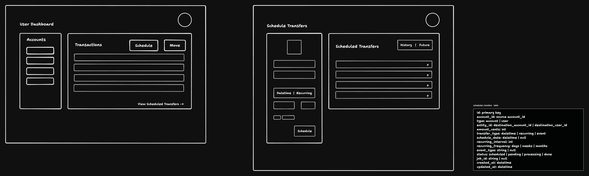
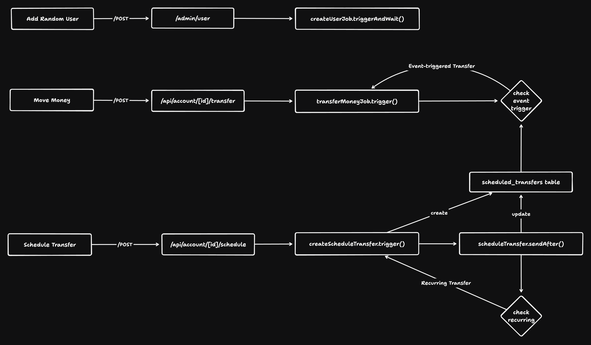

# Notes

## How customers can transfer money

1. **Book Transfers**: Move money between accounts within the same bank instantly, without fees.
2. **Wire Transfers**: Send money electronically between different banks. They are fast but may have fees and require detailed recipient information.
3. **ACH (Automated Clearing House)**: Used for direct deposits and bill payments. Transfers can take 1-2 business days to process.
4. **RTP (Real-Time Payments)**: Instant transfers available 24/7, allowing immediate access to funds.

## What this project builds

**Automation Rules for Book Transfers**

1. **Schedule a Book Transfer**: Send money from one account to another at a specific future date.
2. **Recurring Book Transfer**: Set up a schedule to transfer money on a recurring basis.
3. **Transfer on Receipt**: Automatically send money when you receive a book transfer.

### User Interface

Basic CRUD for automation rules.

1. **Create**: Create a new automation rule.
2. **View**: View all automation rules.
3. **Edit**: Edit an existing automation rule.
4. **Delete**: Delete an existing automation rule.

The UI will also **Display Triggers** on why a transfer happened.

### Events that trigger transfers

1. **Time-based**: Transfer on a specific day of the week, at a specific time.
2. **Event-based**: Transfer when a specific event happens.

## Demo

- Updated the `/transfer` endpoint to use a pg-boss job called `transfer-money`.
  - The primary goal was to move the transfer logic out of the API process and into a job.
  - This allows the API to respond faster and it allows the transfer to be completed asynchronously without blocking the API.
  - This is a much better design for a real-world application as it allows the app, API and jobs to be decoupled and scale independently.
  - Most importantly, it can be expanded to support more types of transfers (e.g. ACH, RTP, Wire, etc.) which can take different amounts of time to complete and have different fee structures, etc.
- Created a `/schedule` page to create and view scheduled transfers.
- Created a `/schedule` endpoing that handles the logic for scheduling transfers.
  - The parameters are very similar to the `/transfers` endpoint.
  - The main differences are the additional parameters for the triggers.
- Added a `create-schedule-transfer` job that can create and setup a scheduled transfer.
  - The primary implementatation creates a `transfer-money` job that is scheduled to run at a specific time.
  - The `transfer-money` job is responsible for creating the transfer and updating the status of the scheduled transfer.
  - The `transfer-money` job is also responsible for retrying the transfer if it fails.
  - The `transfer-money` job also handles the logic for recurring transfers.
  - If the transfer is triggered by an event (e.g. a payment is received), the data is stored in the database, and based on the type of trigger, a `transfer-money` job is created when it is triggered to perform the transfer.

### How does it work

Here's a more concise and high-level overview of the schedule transfer feature, focusing on the design decisions and thought process:

## How does it work

### Key Design Decisions

1. **Decoupled Architecture:**

   - API layer separated from job processing for independent scaling and maintenance.
   - Improves API responsiveness and allows for complex background processing.

2. **Asynchronous Job Processing:**

   - Utilizes `pg-boss` for robust job scheduling and execution.
   - Enables reliable error handling, retries, and dead-letter queues.

3. **Flexible Transfer Types:**

   - Supports one-time, recurring, and event-based transfers.
   - Implemented through a unified schema and specialized job handlers.

4. **Database-Driven Workflow:**
   - Leverages database transactions for ACID compliance in transfer operations.
   - Ensures data consistency across multiple accounts and transactions.

### Core Components

1. **API Endpoints:**
   - `/schedule` and `/transfer` handle user requests.
   - Validate input and trigger appropriate background jobs.
2. **Job Handlers:**
   - `createScheduleTransferJobHandler`: Manages transfer scheduling logic.
   - `scheduledTransferJob`: Executes scheduled transfers and handles recurring logic.
3. **Event-Based Transfers:**
   - `runEventTransfersJob`: Processes transfers triggered by specific events (e.g., deposits).

### Scalability and Reliability

- Background jobs ensure system scalability under high load.
- Retry mechanisms and dead-letter queues handle transient failures.
- Database transactions maintain data integrity during transfers.

### Extensibility

- Modular design allows easy addition of new transfer types or payment methods.
- Job system can be extended to handle complex financial operations or integrations.

This architecture demonstrates a scalable, reliable, and extensible approach to handling complex financial operations in a modern web application.

## Known Issues

- The `event` based trigger can be improved to be a delayed job that is triggered by an event instead of being created by an event.
  - I tried to create a job that would be triggered by an event, but I was unable to get it to work in the timeframe I had.
  - Currently, I implemented it so that the scheduled transfer is stored in the database for an event-based transfer, and then the job is created when the event happens.
  - This is not ideal and should be implemented similar to the time-based trigger which creates a `transfer-money` job as soon as it is scheduled by the user and the job is just triggered at a specific time.
- The refresh on schedule feature does not work, so a user has to manually refresh the page to see the latest scheduled transfers.

## Future Work

- More flexible triggers
  - Expand trigger options to accommodate diverse user needs and complex financial scenarios.
  - Maybe natural language so a user can say "Transfer on the first of every month at 12pm" and it is translated into the correct format.
  - Maybe even a node-based editor so a user can build their own triggers.
- Notifications
  - Implement a notification system to keep users informed about transfer statuses and important events.
  - We can integrate this natively with postgres by using triggers to send webhooks to a notifcation service.
  - This is very important as it can indicate failures and other important events such as low balances before a transfer.
- Webhook support
  - Add webhook functionality to enable integration with external systems and automate workflows.
  - Depending on Slash's userbase, if they use APIs, they can integrate with their own internal systems.
- Improve the current scheduled transfers UI
  - Add a calendar view to see scheduled transfers.
  - Add a single unified list view to see all scheduled transfers if recurring or event-based.

---

Thank you for your time and consideration! I had a lot of fun building this and learned a lot. I hope you like it. Let me know if you have any questions.
